# 03 Scalability

- **粗体**是重要内容，非粗体大多是ppt废话
- 大纲，越末尾越具体（越可以出题）
- 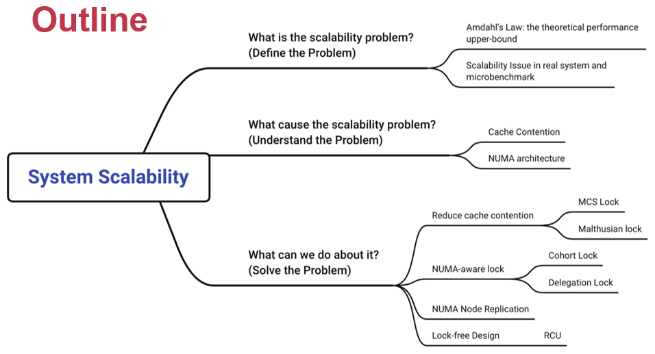

## 定义问题（什么是可拓展问题）

1. 单核和多核
   - 由于功耗墙的存在，单核性能有上限。突破上限需要引入多核
   - 如何完全利用多核是一个问题

2. **Amdahl’s Law**
   - 计算多核情况下的加速比（与核心数和并行度有关）
   - 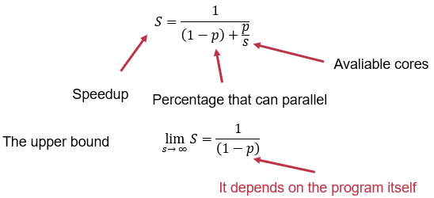
   - 我们需要逼近阿姆达定律的理论上限

3. 示例实验
   - 在一个benchmark中体现可拓展性的瓶颈
   - 为了保护共享数据，使用互斥锁（mutex lock）
      - 只有一个线程可以拿到互斥锁，执行critical section
   - benchmark：一堆线程抢锁，读写共享数据
   - 实验结果显示核心数超过一个阈值，throughput骤降
   - 

## 缓存一致性导致低可拓展性

### 缓存一致性
1. CPU有三级缓存结构
   - L1缓存由一个核心独享，L2缓存由一组CPU共享，L3缓存由所有CPU共享。
   - 一个数据在两个缓存中被读写，可能会导致不一致

2. Cache Coherence（缓存一致性）
   - 目标是为了保证所有核心读到的数据是一致的
   - 一些缓存一致的协议：Snoop(在总线上嗅探)/Directory-based(用目录记录变量的“主人”)

1. **MSI satate machine（一种cache coherence协议）**
   - 定义了三种状态：Modified，Invalid，Shared
   - 定义了多种操作：远程读写，本地读写
   - 用状态机定义操作如何改变状态，以及各状态下合法的操作（如不能远程读写Invalid的cacheline）
   - 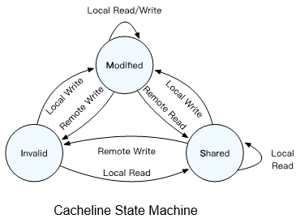

2. **Global Directory（一种MSI的实现）（Directory-based）**
   - 用一个目录记录每个变量属于哪个缓存（目录在内存或者别的硬件里），缓存中每个cacheline都有一个state
   - 当要写缓存时，变量在其他旧主人缓存中状态改成Invalid，自己设置成唯一的新主人，并把变量状态更新为Modified
   - PPT只举了一个例子，总的思路是M表示一个缓存独享该变量，S表示多个缓存共享变量，I表示这个缓存不能用要找别人读。拥有该变量最新值的缓存都是它的主人（M和S）。每次操作根据以上原则更新状态和目录

3. Cache Coherence和可拓展性的关系
   - 多个核争夺一把锁，导致锁的变量在各个缓存中跳来跳去
   - 在阿姆达定律中体现为p大幅降低（为了保持缓存一致导致大量开销）

### 解决方案：高可拓展性的锁 

1. 简易实现：back_off 
   - 轮询拿锁时每个循环sleep一段时间，避免多个CPU同时抢锁的情况
   - 没有断崖了，但是在低负载下性能变差（overhead高）。治标不治本

2. **MCS锁**
   - 把对单点的竞争改进为多点
   - 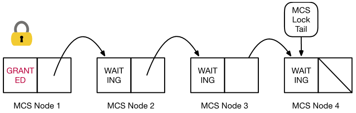
   - 每一个拿锁的线程维护一个节点，排队的节点穿成一个链表。节点由两部分组成，一个表示锁当前状态，一个是指向排队的下一个锁的指针。
   - 如何加入新节点：有一个公共尾指针指向排在最后的节点，把新节点状态设置成waiting，并把原尾节点的指针核公共尾指针指向新节点。
   - 如何放锁：释放原节点，并根据指针找到排队的下一个节点，把该节点的状态更新为granted。
   - 如何轮询：每个线程轮询自己节点的状态即可，锁不再跳来跳去
   - 实验证明效果不错，但核心数量变非常多时性能依然有瓶颈，因为LLC(Last-level-cache，即L3缓存)大小有限

3. **Malthusian锁**
   - 为了进一步提升MCS锁性能，减少缓存开销
   - 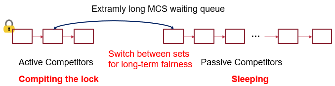
   - 把队列头部几个节点设置成需要轮询的活跃节点，后面靠后的节点直接sleep等待唤醒（减少参与竞争的核心数）
   - 实验证明可拓展性进一步增强（延迟也变高了）

## 面向NUMA架构的可拓展性
1. 新的问题
- MCS很快，但是NUMA上还是不行。NUMA架构的CPU是分开的，每组CPU有Local Memory。跨节点读取内存开销很大
- 跨节点共享锁和数据开销很大

2. **面向NUMA架构的锁(Lock cohorting)**
   - 设置一个全局锁和多个本地锁。当一个NUMA节点拿到全局锁，把资源拿到本地由本地的线程竞争（本地锁），用完后再放全局锁。
   - 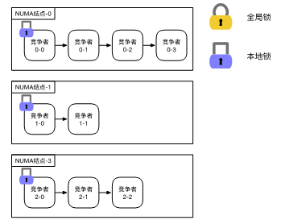
   - 减少了共享数据跨节点传输的次数，性能有所好转

3. **一个更聪明的Cohort锁**
   - 即将被并入Linux 内核
   - 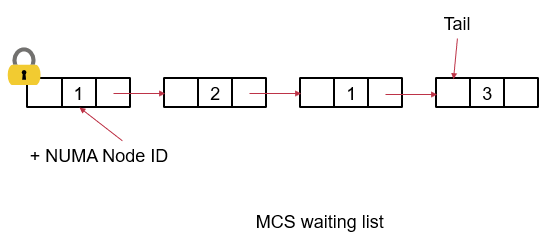
   - 节点记录所属的NUMA节点，放锁时跳过属于不同NUMA的节点，遍历完list找不到同节点的等候者则把锁交给其他节点。
   - 进一步改进：放锁时遍历整个list太蠢了。等候者在等待时，更新等候队列的顺序，让同一NUMA下的节点串在一起，这样放锁时可以跳过一串属于其他NUMA的节点，更快地遍历整个list

### 代理执行
1. cohort锁的问题
   - cohort锁依然有性能断崖

2. **Delegation Lock**
   - 核心思想是把锁固定在一个核中（代理核），其他核通过访问请求的方式来轮询锁。其他锁把参数交给代理核，代理核执行本地函数并返回是否拿到锁。
   - 代理核可以是固定的也可以是动态的
   - 代理锁的性能远远超出cohort锁，在低竞争时overhead很大
   - 以上三种锁的对比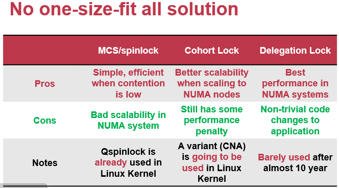

### Node Replication
1. **Node Replication**
   - 思路：把数据在每个NUMA节点中都存一个备份
   - 所有读操作都是本地读，写操作用一个全局log，用来更新每一个备份
   - 所有操作用tick记录，根据tick决定变量的最新值，本地有一个表记录所有变量的最新tick，以决定读变量时是否更新
   - 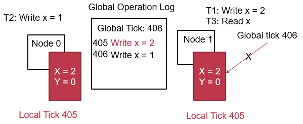

### libnuma
1. libnuma
   - 显式地在别的numa节点或本地节点申请内存，由应用程序来维护内存位置

## **Lock-free design（RCU）**
1. Read Copy Update（RCU）
   - 传统的读写锁会有拿锁开销，同时对数据读写会不可避免地阻塞住后来者
   - RCU抛弃锁，让读和写可以同时进行

2. 机制
   - 借助指针原子添加新的内容
   - 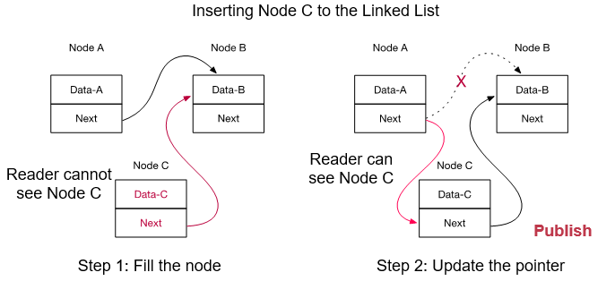
   - 借助指针原子删除和更新内容
   - 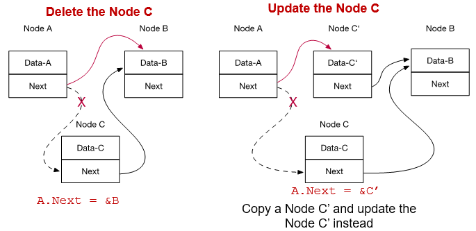

3. 监视读者
   - RCU中，当删除一个节点时，即使事先改变指针让该节点脱离原来的list，此时可能有读者在指针改变前进入了待删除节点。因此RCU需要监视读者的状态来决定是否释放掉被删除的节点。
   - 根据读者的读写时间判断。假设删除操作在时间T发生，那么只要还有在时刻T前开始读的读者没有结束，就不释放被删除节点。当所有T前开始读的读者结束，就可以释放掉被删除的节点了。

4. 性能
   - 读者读的行为本质是通过指针找到下一个节点。写者写的行为本质是更改节点，两者不冲突。
   - 观测读者和释放节点的工作可以异步地来做。
   - 缺点是RCU不好用，RCU无法在双向链表中实现。