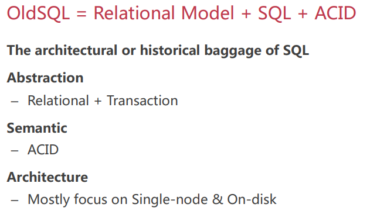
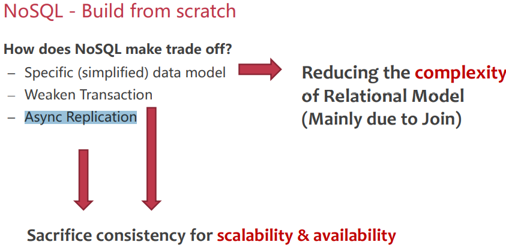
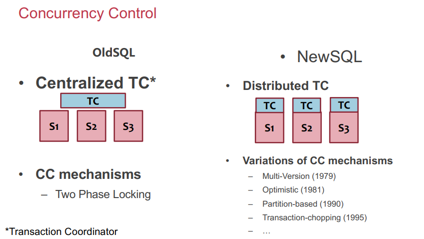
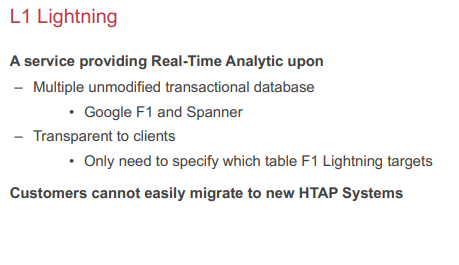
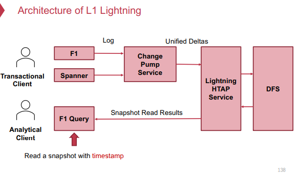

# 07 SQL

- DBMS **和 KV 数据库**比较：In a key-value store, all the relationships and operations are managed  **by the programmer** (**p29**左右)

### 关系模型（p32起）

关系relation, 元组tuple

怎么定位一个tuple？Table name + primary key

##### 

### DML （Data Manipulation Languages）

- **procedural 过程式、declarative 声明式**

### 关系代数（p40-50）

### 复杂数据关系的表示（p59起）

- Duplication and normalizing 重复和规范化（p65）

- representing one-to-many 表示一对多关系（p66）

1. 解决方案1：**添加新表和外键**
2. 解决方案2：**document model 文档模型** （一对多关系）

### Document model 文档模型（e.g. JSON）

- schema flexibility：任意修改schema
  - 关系数据库中的schema更改**很慢**

**关系模型和文档模型对比**

##### 

### OldSQL → NoSQL → NewSQL → HTAP

#### OldSQL（p81）

- **OldSQL = Relational Model + SQL + ACID**

- OLTP transaction
  - 生命周期短
  - 需要的数据量小

##### 

#### NoSQL（p91）

##### **Scale Horizontally with Middleware 使用中间件横向扩展**

- **[√]** Read/Write single Record 

- **[×]** No Distributed Transaction & Join 
  - Unavailable when: Changing schema - Server failover 
  - Data Scaling & Re-sharding

##### tradeoff（p95-99）

- 简化数据模型 => 降低复杂度
- 弱化transaction，异步复制 => 牺牲一致性，换取scalability和availability

##### 

#### NewSQL（p105）

定义：A class of modern RDBMS, which provides:

- NoSQL’s Scalability
- SQL’s ACID Transaction & Relational Model

怎么扩展scale？

- **Shared-nothing Partitioning**

##### 

#### HTAP(Hybrid Transactional/Analytical Processing)（p131）

-  **real-time analytics on fresh data**

- OLAP (ML)

##### L1 Lightning（p137-140）

##### 