# 07 SQL

- DBMS **和 KV 数据库**比较：In a key-value store, all the relationships and operations are managed  **by the programmer** (**p29**左右)

### 关系模型（p32起）

关系relation, 元组tuple

怎么定位一个tuple？Table name + primary key

##### 

### DML （Data Manipulation Languages）

- **procedural 过程式、declarative 声明式**

### 关系代数（p40-50）

### 复杂数据关系的表示（p59起）

- Duplication and normalizing 重复和规范化（p65）

- representing one-to-many 表示一对多关系（p66）

1. 解决方案1：**添加新表和外键**
2. 解决方案2：**document model 文档模型** （一对多关系）

### Document model 文档模型（e.g. JSON）

- schema flexibility：任意修改schema
  - 关系数据库中的schema更改**很慢**

**关系模型和文档模型对比**

##### 

### OldSQL → NoSQL → NewSQL → HTAP

#### OldSQL（p81）

- **OldSQL = Relational Model + SQL + ACID**

- OLTP transaction
  - 生命周期短
  - 需要的数据量小

##### 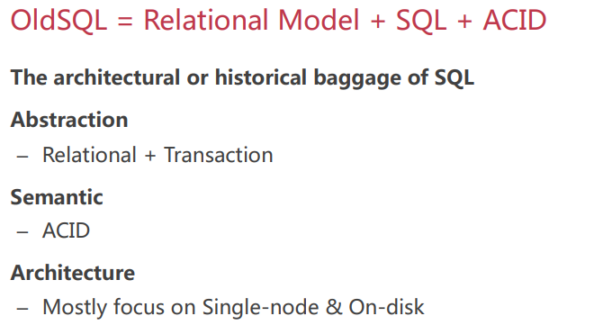

#### NoSQL（p91）

##### **Scale Horizontally with Middleware 使用中间件横向扩展**

- **[√]** Read/Write single Record 

- **[×]** No Distributed Transaction & Join 
  - Unavailable when: Changing schema - Server failover 
  - Data Scaling & Re-sharding

##### tradeoff（p95-99）

- 简化数据模型 => 降低复杂度
- 弱化transaction，异步复制 => 牺牲一致性，换取scalability和availability

##### 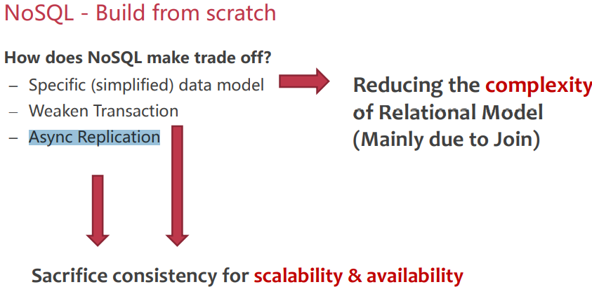

#### NewSQL（p105）

定义：A class of modern RDBMS, which provides:

- NoSQL’s Scalability
- SQL’s ACID Transaction & Relational Model

怎么扩展scale？

- **Shared-nothing Partitioning**

##### 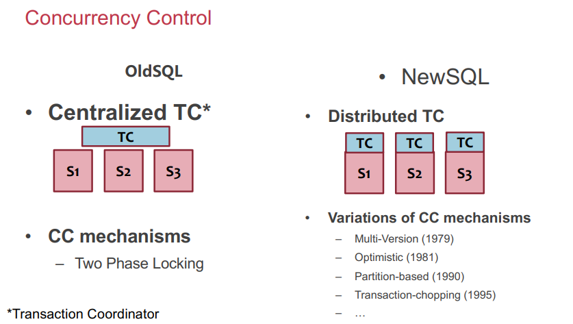

#### HTAP(Hybrid Transactional/Analytical Processing)（p131）

-  **real-time analytics on fresh data**

- OLAP (ML)

##### L1 Lightning（p137-140）

##### 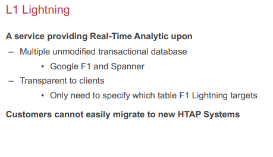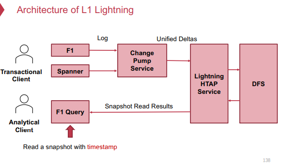

# 08 Transactions

- **Atomicity**: TX is either performed entirety or not performed at all. **(rollback回滚)**

- **Cosistency**: Transaction must change the data from a consistent state to another

- **Isolation**: Two concurrently executed transactions are isolated from each other

- **Durability**: Once a transaction is committed, its changes must durably stored to a persistent storage

如何保证？**（p28）**

- **I：一致性控制方法**

### Serializability（p31）

- 是理想化的：**并发事务T1,T2,...,TN好像是按顺序执行的一样**

- 如何检查是不是serializability？replay the concurrent execution to a serial of reads/writes（**例子p35-42**）

#### Serializability的实现（p45）

##### 使用锁lock

- 全局锁global lock：一次只能一个TX， 不并发（性能差）
- 简单细粒度锁simple fine-grained lock：每个record有一个锁（锁容易放太早，不正确）

- **Two-phase locking** 2PL：TX commit之后再放所有的锁 -> **保证Serializability**

##### 

##### 2PL的问题——deadlock（p61）

##### 解决方法：

##### 

### Optimistic concurrency control -- OCC（p67）

- Executing TXs **optimistically** w/o acquiring the lock
- Checks the **results of TX** before it commits
  - If violate serializability, then **aborts & retries**

##### 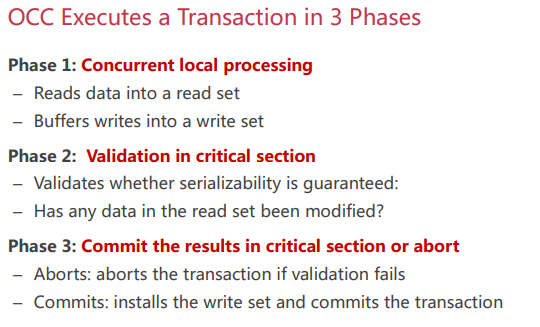

##### **具体例子（p69-80）**

##### 好处：

- phase1: Operates in **private** workspace;  **rare inter-thread**  synchronization (optimistic)
- phase2, 3: Needs synchronization, but usually very **short at low contention**

##### 问题：

- False Aborts 错误的abort
- livelock：high contention情况下，一直abort，没有progress

##### 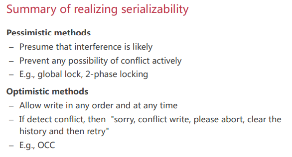

### Modern Transaction  Systems（p89）

#### HTM（p92）

#### intel RTM（p96）

##### 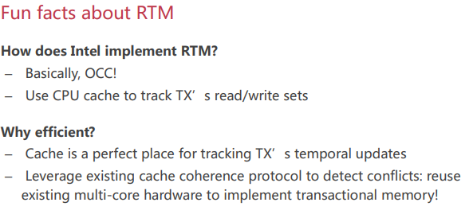

**Hardware support for transactional memory总结**

- Easy programming model for the programmer
- Good performance if using properly
- However, the programmer should handle its pitfalls

#### DBX（p111）

a TX system to use **RTM for acceleration**, but **avoids its pitfalls** for TXs

##### 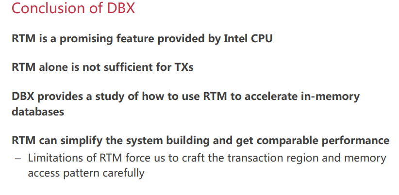

#### ROCOCO（p135）

**回顾：优化TX的方向？Improve the TX algorithms properties**

- E.g., better deadlock detection algorithms in 2PL
- E.g., reduce aborts in OCC

##### 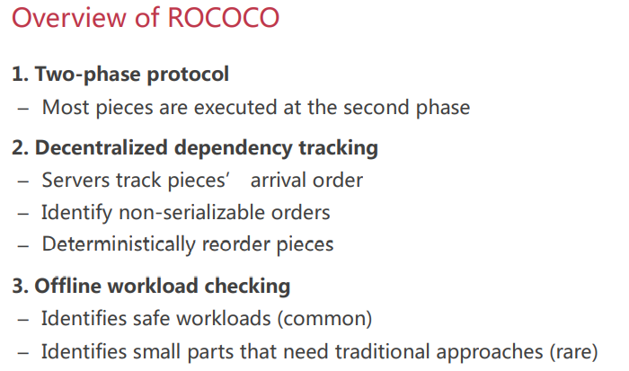

##### 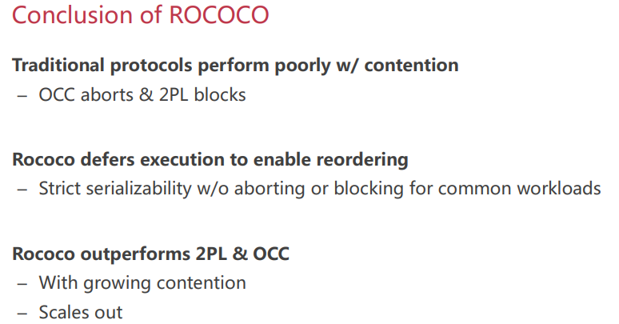