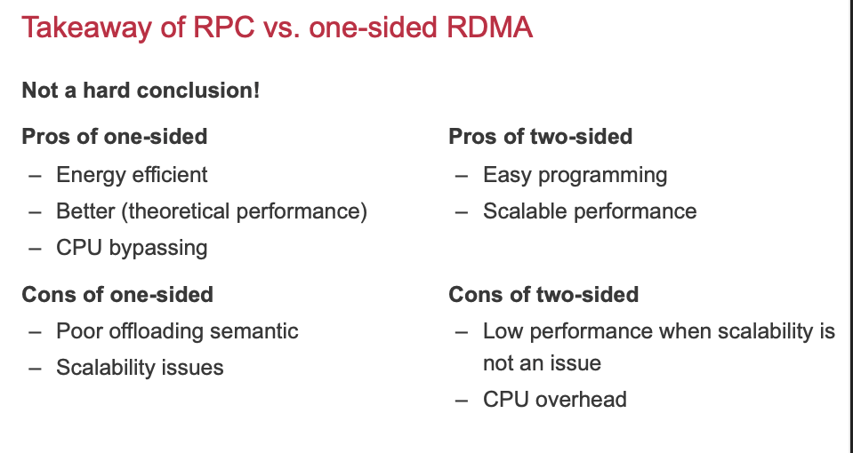
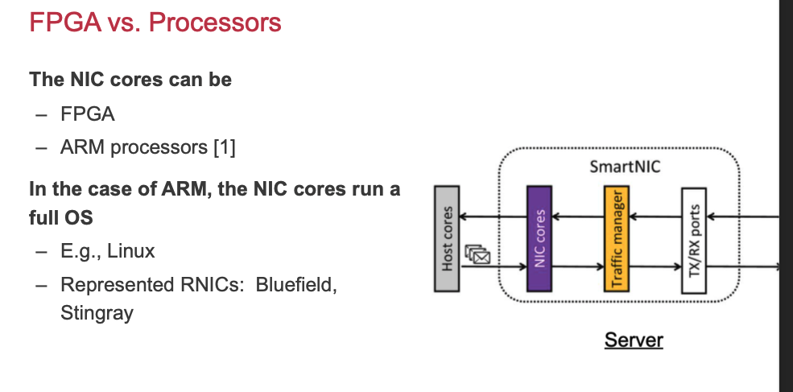
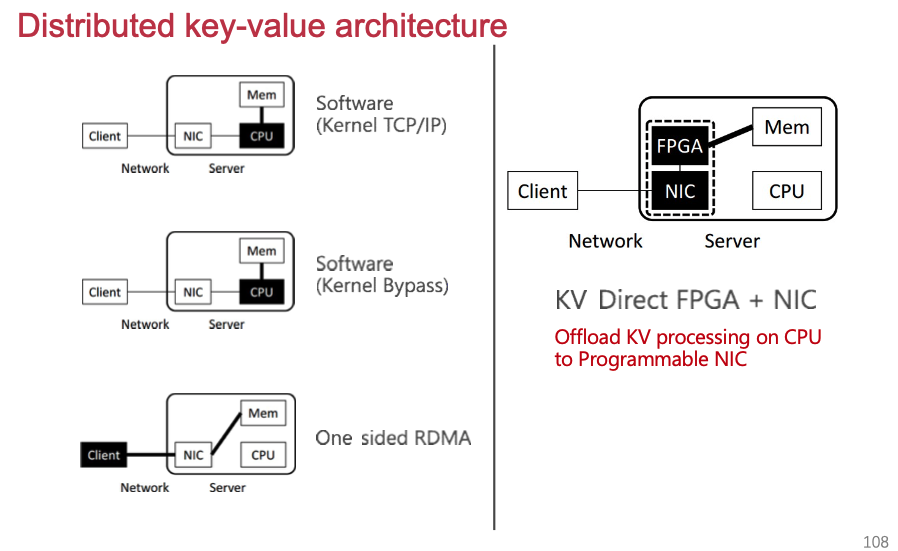

# RDMA

## Basic knowledge

Kernel bypassing network: DPDK

* Userspace, driver lib 来使用网卡
* 优势
  * bypass kernel
  * 减少memcpy overhead
  * 用户可以定制化网络，不需要使用TCP/IP协议
* 不足：
  * 扔就需要软件栈来实现general-purpose networking, 比如用户态协议栈

CPU bypassing:

* CPU很难变快了 ——power wall
* NIC网卡持续变快， 200Gbps
* 数据中心需要节能，polling会导致能耗高，中断会导致性能差(超过100X)
* 方案：单边RDMA，可以bypass CPU

RDMA目前的特定

* 价格更低
  * $19/Gbps (RDMA 40Gbps) vs. $60/60Gbps (Ethernet 10Gbps)
* 向下兼容性( downward compatibility)
  * RDMA atop RoCE supports fast ethernet (compatible with existing datacenter apps)
* 在现代数据中心中应用广泛
  * Even avaliable in the public cloud

## Case study: dsitributed kv store

### Farm-KV @NSDI'14

Goal: 使用单边RDMA来建立分布式KVS

Question:

- 我们使用的是single node KVS
- 我们是否可以将内存访问替换为远端内存访问？

Problem:

- 单边RDMA速度还是比本地内存访问慢很多 （2 us vs 100ns）

传统HashIndex会增加更多的network roundtrips

Network amplification: 远端内存在网卡端只有非常简单的抽象；实现high level的KV抽象需要更多NIC网卡操作

因此，FaRM对数据结构(hopscotch hashing)进行了重新设计。Hash之后的key对应的bucket，能够保证目标entry一定在有限个bucket offset中（相当于进行了一个限制）。这样就可以通过一次RDMA Read来把offset个bucket一次性读回。

但是Update会变得更加复杂（需要更多rehash操作）

## RDMA实现细节

但是RDMA的cost还是很高：PCIe latency, network latency.

Outstanding request & coroutine

* Outstanding requests means keep multiple RDMA requests on-the-fly
* Coroutine is the same as traditional asynchronous I/O programming
* Goal: hide polling latency

doorbell batching

* One MMIO to post a batch of requests, NIC uses DMA to read them

RDMA: out memory design

**Connection, translation, permissions, etc. information are stored on the host memory**, NIC only caches them in its SRAM, but with a limited space(~2MB). When cache miss, use PCIe read to fecth them.

一些缓解方案：

* FaRM@NSDI'14: use huge page
  * Reduce #PTE entries
* LITE@SOSP’17 takes to another extreme; it directly physical memory, and uses kernel for security check
  * No PTE and keys need to be cached at the NIC!
* FaSST@OSDI16: 使用UD
  * 减少QP，没有connection信息

## SmartNIC

On-path vs. off-path

FPGA vs. Processors

为什么智能网卡慢：

- 功耗限制
- 读取Host DRAM需要进过PCIe

KV-Direct:

# Fault Tolerance

### Recovery恢复

Goal: 从crash 或者网络failure中恢复状态

正确性保证：未commit的continue or abort；已经commit的数据可以持久化

Solution: **Logging**

**Write-ahead logging** (WAL)：在更新数据状态之前，把log先写入磁盘；并且log是append-only的;

在Commit的时候，添加一个特殊的Log：CMT (Commit Log)

Recovery Rules:

日志与并发事务：

- 单个log queue
- 多个log queue

性能考虑：

- 局部性（log序列化考虑Sequential IO）
- 并发控制（会增加tail latency）

我们为什么需要flush disk:

* No need to recovery from a blank state
* Avoid aborting long transaction

刷磁盘的频率：不是只在最后的时候把log刷入磁盘——checkpoint

T1: do nothing; T2: redo; T3: redo; T4: undo; T5: undo

WBL (write-behind logging)

Primary-backup 主从备份

Fault tolerance机制：

* Replicated machins
  * Fully replication of data
* Log
  * Synchronize data updating

