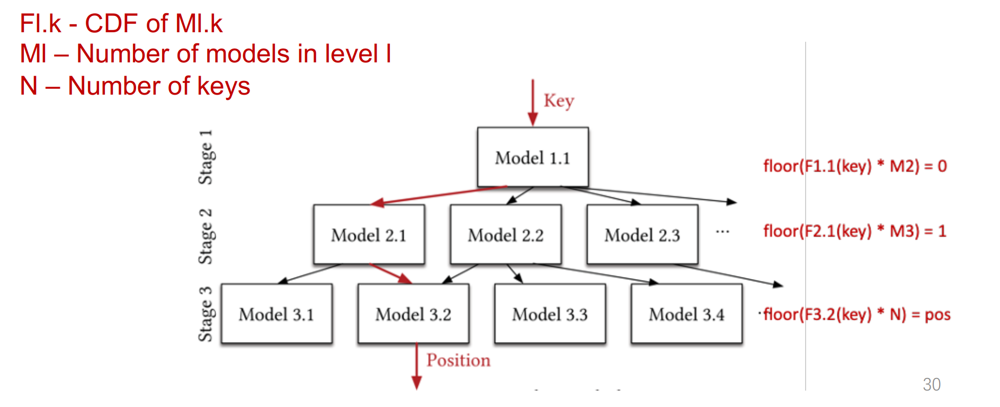
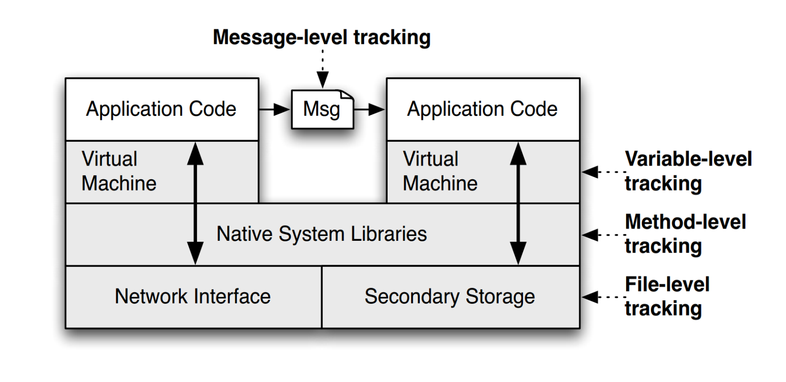

### 13. AI for system
AI能够给系统以下部分进行提升: indexes, joins, sorting, caching, hash tables, scheduling, planning

#### 索引优化
举例: 为100到1M的整数建立索引 **Data=[100,101,102,...,1M]**
- 如果我们知道数据分布,则索引可以表示为**Data[key-100]**
- 如果数据为偶数分布  **Data=[100,102,104,...1M]**
- 索引可以表示为**Data[(key-100)/2]**

使用传统的数据结构例如B+树,最差情况下的复杂度为O(log(n)),如果使用AI模型可以缩减到**O(1)**

#### 1. learned index(仅查找)
限制条件:
- 只读不能进行写操作,因为会改变数据分布
- 数据以顺序数组形式存储
  
**动机:** 
将BTree当作一种模型, BTree的每一个叶节点都是一个page, 每个page中包含一段连续数据, 在查找key时, 首先映射对应的叶节点, 即pageID, PageID = BTree(key), 随后在[pos, pos+page size]这段范围查找value.

**learned index:**
建立模型将 key直接映射为有序数组中的pos, key->pos
在 [pos-err_min, pos+err_max] 中查找, key->pos的映射关系在有序数组中相当于累积概率模型CDF,\#keys为key的数量

pos = P(X <= key) * #keys = F(key) * #keys

err_min和err_max在训练中的计算方法
```
for key,pos in sorted array:
    if model(key) >= pos:
        err_min = max(err_min, model(key) – pos)
    else:
        err_max = max(err_max, pos – model(key))
```
**使用learned model的潜在优势:**
- 更小的内存访问: 在预测后只有O(1)的内存查找
- 更小的索引: BTree使用很大的内存空间存储索引, 而如LR(线性回归)只需要占用8B, pos = key * w + b

**直接使用tensorflow实现模型出现的问题:**
- tensorflow为大型模型设计,不适用于小模型训练,效率低
- 不能过拟合,意味着模型预测有很大的错误

**Last Mile Problem:**
- 数据中的离群值(不贴近CDF曲线的数据点)会对模型预测产生影响,偏离值越大,预测错误越多
- 使用RMI(Recursive Model Index),递归模型索引来解决,将key预测任务分散到各个小模型之中减少错误.

key通过顶部模型来决定分发到哪个子模型,依次传递到最终预测模型来预测key对应的数组中pos

**如何在有序数组预测到的范围内查找key:**
- 使用二分查找
- 优点: 如果搜索空间很大,复杂度从O(N)降为O(log(n))
- 缺点:如果搜索空间很小,CPU会执行很多分支预测操作开销

#### 2. ALEX(查找与插入)
为什么learned index不能进行插入操作,因为它假设数据有序排列没有空间进行插入,如果插入数据需要移动其他key的位置

**ALEX创新点**
- Gapped Array
- Model-based Insert
- Adaptive Tree Structure

**ALEX缺点**:不支持并发,只支持单线程设置,当一个节点预测模型正在训练时不支持另一个线程并发查找

**Gapped Array**
gapped array中数据不是连续放置,而是存在空隙

gapped array使得插入数据只需要移动几个key,实现更快的插入,它的缺点为
- 可能将key移动到其他位置上,则模型预测就会偏离
- 不能使用二分查找, 使用指数搜索

**Model-based Inserts**
相对于普通的插入,比如先插入数据,然后训练模型能够预测插入位置,ALEX在新的数据开始插入时,首先使用模型预测插入位置并在模型预测位置处插入数据.之后一段时间后重新训练模型.

**Adaptive Structure**
灵活的树结构
- 将节点分裂为兄弟节点
- 将节点分裂为子结点
- 在gapped array没有多余的空隙时,拓展数据节点,插入更多空隙
- 合并节点

#### 排序优化
常见的基于比较的排序方法: 冒泡排序, 插入排序, 快速排序, 归并排序
上述的基于比较的排序方法至少需要 O(Nlog(N))的复杂度

**Counting Sort 计数排序**

- 对input array内的数据进行技术写入count array
- 使用count array统计出累积概率,写入CDF数组, 例如count array中0,1,2出现1,2,2次,则CDF中0,1,2位置记为1,1+2=3,1+2+2=5
- 根据CDF来填写output array并减去CDF中的值,例如CDF中2位置的值为5,表示在output array中pos=5的位置一定是2,则在pos=5放入2,并在CDF中2处减1.

**使用AI模型来优化排序**
将排序任务作为预测任务,根据元素的值预测在数组中的位置
pos <- ECDF(key) * N

)
- 使用RMI来作为预测模型
- 为了防止预测位置出现冲突或前后颠倒,使用bucket存储区间内的元素,随后bucket内进行排序
- 当bucket填满后,将额外的bucket扔到单独的数组中
- 在bucket内部,使用快速排序进行排序
)

#### 使用模型加速基于RDMA的key-value存储查找
**传统的分布式KVS**
)
缺点:
- 服务器CPU是瓶颈
- CPU能耗是另一个问题,因为CPU必须使用polling来处理消息实现低延迟

**使用NIC查找的KVS**
)
使用NIC直接读写内存,将服务器CPU绕过
缺点:
- NIC只具有简单的抽象,例如内存读/写,对于简单索引例如hash可以使用,对于复杂索引例如B+Tree在一个RTT中一次只能读写一层
- 对于100M的KVS,至少需要7个RTT才能查找到key位置

**客户端缓存B+Tree来查找KVS**
缺点:
- B+Tree索引会消耗很大的客户端存储
- Tree node大小可能比KV还要大
- 插入元素后客户端不能及时更新

小结:
- 服务端为中心的KVS: 高CPU利用率
- 客户端通过NIC: 低性能
- 客户端cache: 高存储

**使用模型的KVS:XSTORE**
使用模型直接计算key在服务端内存中的地址
)
- 通过服务端B+Tree学习key->address的映射
- 客户端cache中的模型通过key获取在KV中key-value的地址
- 通过NIC读取对应value

**XSTORE面临的问题**
- 频繁的插入元素会使得KV地址改变
  在有序元素中插入新元素会改变原来KV的地址使得模型无效
  解决办法: **Translation Table(TT)**,使用逻辑地址来表示key的地址, 增加TT来存储逻辑地址和物理地址的映射
)
)
- 插入/删除会使得原先训练模型无效
  解决方法:1. 两层结构的模型 2. 特定领域选择特定模型 3. 过期检查和快速回退
    - 两层模型架构,top model使用NN,bottom model使用LR
      )
      top model为key分发对应的bottom model,bottom model即LR选择具体的地址,由于LR单调和TT,只有B+Tree节点分裂的时候模型才会过期.
    - 特定领域选择特定模型
      - 顶部使用NN:1.高准确性 2.在元素插入后不需要重新训练
      - 底部使用LR(线性回归):1. 重新训练速度快,无需迭代训练 2.可以使用很多LR提高预测准确性
    - 过期检查和回退
      - 失效的情况:只有当Btree节点分裂时，模型才会失效
      - 过期检测: 
        - 在TT中编码Btree序列号
        - 将TT的版本与fetch节点的序列匹配
        - 如果不匹配，回退到RPC,重新获取模型

XSTORE使用一个后台线程训练模型,当插入导致分裂时重新生成模型

### 14. Security: Attack and Defense
在任何安全系统中,最脆弱的环节是人

**Trusted Computing Base (TCB)**:
- 需要要有信任的起点, 即TCB
- 其他的信任机制基于root of trust
- TCB可以是人, 软件, 硬件
  - 人: 制造商, 关键组件的开发者
  - 软件: BIOS, VMM, kernel loader
  - 硬件: TPM, secure processer

**OS作为Reference Monitor(RM)**:
- OS是运行process(subjects)和文件files(objects)的集合
  - 进程与user关联
  - 文件有 access control lists(ACLs)控制
- OS执行一系列安全策略
  - 文件需要通过ACL检查
  - 进程不能在其他进程内存中写操作
  - 一些操作需要superuser权限
- 对于同一用户所有进程使用同一个策略
  
)

什么使得一个进程是安全的?
- 内存安全: 不越过数组边界，不要操作另一个进程的内存，不要像执行代码一样执行数据
- 控制流安全: 所有的控制传输都是由原程序所设想的
- 类型安全: 所有函数调用和操作都有正确类型的参数

隔离:
- 每个进程应该存在于自己的地址空间中, 但是进程间通信的性能成本(IPC)正在增加
- 上下文切换非常昂贵
- 捕获到OS内核需要刷新TLB和缓存，计算跳转目的地，复制内存

**Software Fault Isolation (SFI)**:
- 进程位于相同的硬件地址空间中;软件RM将它们隔离开来
  - 每个进程被分配一个逻辑"fault domain"
  - 检查所有的内存引用和跳转，确保它们没有离开进程的域
- 权衡:检查成本 vs. 通信成本
  - 为每次内存写和控制转移付出执行检查的成本
  - 当陷入到kerne时，节省上下文切换的成本

#### Control flow attack 控制流攻击
举例:ROP攻击 Return-oriented Programming
- 在已有代码基础上找到code gadgets, 通常gadgets由1-3个指令组成,ret结尾
- 将这些gadgets的地址压到栈上
- 通过gadgets末尾的ret连接执行各个gadgets
- 实现无代码注入的攻击

**如何防范这种攻击?**
- 隐藏二进制文件
- ASLR(Address space layout randomization)来随机化代码地址
  - 改变内存空间布局
  - 每一次进程创建时随机
- Canary金丝雀机制保护栈, 预防栈溢出攻击
  - 将金丝雀,即一段随机数字,放入栈帧中(返回地址下),在每次函数返回时检查是否被改变
  - StackGuard作为GCC的补丁实现

#### CONTROL-FLOW INTEGRITY (CFI)
**什么是control flow graph?**
- 每个函数中的代码被分割为多个基本块(Basic Block,BB),每个BB只有一个入口
- CFG中的顶点: 基本块
- CFG中的边: 控制依赖
)

**什么是CONTROL-FLOW INTEGRITY(CFI)?**
- **main idea: 预先确定一个应用的CFG**
  - 对源码进行静态分析
  - 静态二进制分析 <-CFI
  - 执行采样
  - 明确安全策略
- **策略: 程序执行必须路线必须在预先确定的CFG内**
- **方法: 二进制插桩**
  - 使用二进制重写来进行插桩检查运行时代码
  - 插入检查代码确保执行总在确定的CFG内
  - 确保跳转目标是CFG内合法目标
  - 目标: 即使攻击者完全控制线程的地址空间也能确保安全
- **CFI控制流执行**
  - 对于每个控制转移，静态地确定其可能的目的地
  - 在每个目的地插入一个唯一的位模式(bit pattern)
  - 两个目的地是等效的，如果CFG包含从同一来源出发的边
  - 对于等价的目的地，使用相同的位模式
- **CFI安全保证**
  - 有效抵御基于非法控制流传输的攻击
  - 不能保护不违反程序的原始CFG的攻击

**内存攻击模型**
)
)
)
)

#### TAINT CHECK
**TaintCheck的主要思想:**
- 程序执行通常来自可信的来源，而不是攻击者的输入
- 所以外来输入可能是攻击源, 对所有输入计算机的数据进行 tainted(污染)
- 监视程序执行并跟踪受污染数据的传播方式(跟随字节、算术操作、跳转地址等)
- 检测被污染的数据何时以危险的方式使用
  
TaintCheck首先通过一个模拟环境(Valgrind)运行代码，并添加指令来监视受污染的内存, TaintCheck检测主要包含3个模块:
- **TaintSeed**: 将不受信任的数据标记为污染
- **TaintTracker**: 跟踪每个指令,确定结果是否被污染
- **TaintAssert**: 检查污染数据是否用于危险的地方,比如
  - 跳转地址: 函数指针
  - 格式化字符串: 是否使用污染数据作为格式化字符串参数
  - 用于系统调用

)

TaintCheck可能出现假阳性问题,即使没有攻击也会报使用非法,这个特性可以用来检查系统薄弱环节.

#### TAINT DROID
**背景知识:Android**:
- Android中应用使用Java编写
- Java native interface(JNI)用于调用C++等底层库或系统API
- 源代码编译为Dalvik Executable(DEX)字节码形式
- 在Dalvik VM解释器中执行
- 组件间通过binder IPC机制通信

动机: 更好的保护当前Android系统隐私
和TaintCheck一样,使用某些方法对数据进行污染并跟踪

**Taint Source 数据来源**:
- 低带宽传感器: 地理信息, 加速计
  - 经常更改，并被许多应用程序使用
  - 大多数智能手机操作系统都有某种类型的管理器来多重处理这些信息
- 高带宽传感器: 麦克风, 相机
  - 返回大量的数据，并且一次只能被一个应用程序使用, hook放置在数据缓冲区中
- 信息数据库: 地址信息,SMS, 通话记录
- 设备标识符: IMEI
- 网络
- WiFi: 3G, SMS

**Taint Droid架构:**
)
TaintDroid跟踪以下级别数据
- 消息级别
  - 使用Binder IPC 机制
  - 标记整个消息而不是标记变量
- 变量级别
  - 最主要的追踪方法
  - 仅对一个数组保存一个tag,可能导致假阳性
- 方法级别
  - VM内部方法: 使用较少
  - JNI方法
- 文件级别
  - 污染tag存储在扩展的文件属性中
  - 整个文件被标记
  - 变量访问时污染从文件传播到变量

**Taint Droid流程:**
)
1. 污点接口调用一个native方法
2. 此方法interface一个native解释器
3. 其中virtual taint map存储污点标记tag
4. 受信应用使用污染数据IPC通信时, 通信包中也包含污点tag
5. 使用binder kernel module传输, 被不可信app接收
6. 远程binder会从信息包接收污点tag,标记本地map
7. 传给动态库
8. 不可信app调用动态库,使用污染数据,被检测并报告

**Taint Droid贡献**
TaintDroid为每一个被测试的应用程序生成有用的结果, 并实现了一个有用的隐私分析工具

**缺点**:
- TaintDroid可以通过隐式信息流来规避
- TaintDroid不能告诉是否被污染的信息在离开后重新进入手机
- 可以使用侧信道(side-channel)攻击绕开
- 可以使用下面方法避免数据污染
  ```
  if (x == 0) y = 0; 
  else if (x == 1) y = 1; 
  ...
  else if (x == 255) y = 255; 
  ```

#### PUMP 基于hardware的安全
**目标**:
- 用户定义的元数据处理
  - 处理任意元数据大小
  - 任意策略
  - 低开销:低性能和硬件资源开销
  
**PUMP: programmable unit for metadata processing**
- 每个word有一个指针大小的tag
  - 小tag直接存储,大tag存储在内存中
- 标记内存, 缓存, 寄存器, PC等的使用
- tag不可被寻址

)

#### ADDRESS SANITIZER 基于compiler的安全
)
- 追踪内存访问的边界
- 主要包括两部分：插桩(Instrumentation)和动态运行库(Run-time library)。插桩主要是针对在llvm编译器级别对访问内存的操作(store，load，alloca等)，将它们进行处理。动态运行库主要提供一些运行时的复杂的功能(比如poison/unpoison shadow memory)以及将malloc,free等系统调用函数hook住。该算法的思路是：如果想防住Buffer Overflow漏洞，只需要在每块内存区域右端（或两端，能防overflow和underflow）加一块区域（RedZone），使RedZone的区域的影子内存（Shadow Memory)设置为不可写即可。

#### SHUFFLER 基于系统运行时的安全
**主要思想**:
- 连续Re-Randomization,持续随机代码地址
- 在攻击者使用代码之前重新随机化代码
  - 比泄露漏洞执行时间更快;
  - 比小工具链计算时间快;
  - 或者，比网络通信时间更快

)
**异步随机化**
- 将新代码拷贝, 修改call指令, 更新code pointer table放入shuffler thread异步执行,最后同步修改代码栈
- 同步时间只占全部时间0.3%

**返回地址加密**
- 使用正常呼叫指令
- 用XOR密钥加密返回地址
- 防止泄露返回地址
- 使用二进制重写
)