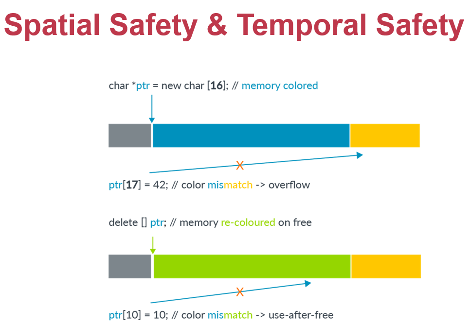
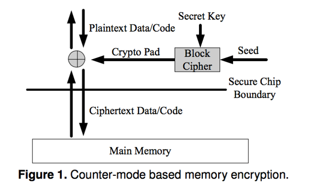
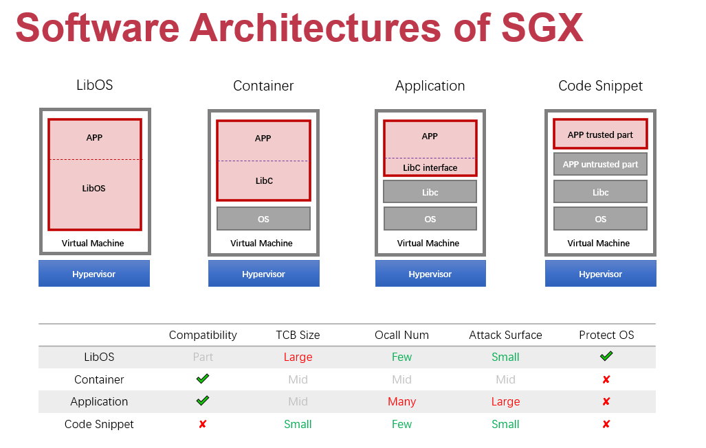
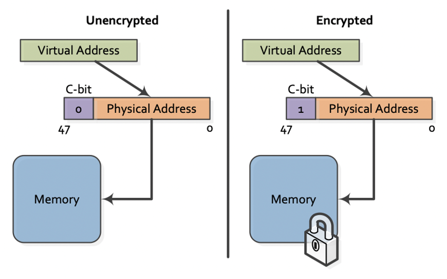
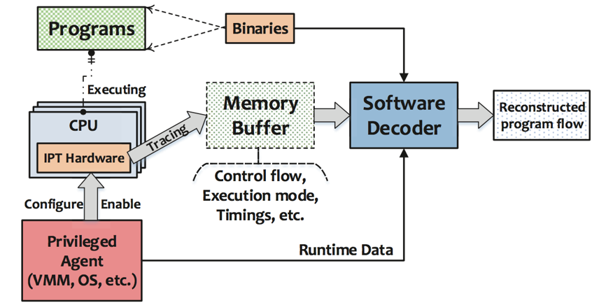

# 15. Hardware Security
## Hardware Features Designed for Security
### SMEP/SMAP: Supervisor Mode Execution Prevention/Supervisor Mode Access Prevention
Return-to-user Attack: 内核代码中某些函数指针被设为NULL，dereference时跳转到用户代码。通过SMEP/SMAP禁止内核访问/执行用户代码。

- SMEP: Allows pages to be protected from supervisor-mode instruction fetches. If SMEP = 1, OS cannot fetch instructions from application
- SMAP: Allows pages to be protected from supervisor-mode data accesses. If SMAP = 1, OS cannot access data at linear addresses of application
- ARM的类似技术：PAN, Privileged Access Never; PXN, Privileged eXecute Never; UAO, User Access Only

应用：使用SMAP做进程内隔离，将用户代码放在内核态，需要保护的数据放在用户态

ret2dir Attack: 每一页物理内存都同时拥有kernel和user两个虚拟地址，虽然禁止内核执行用户代码，但通过跳转到恶意代码对应的kernel地址仍可攻击。

### MPX: Memory Protection eXtension
Background: C/C++ bounds error (可通过gcc的-fcheck-pointer-bounds flag防止)

Intel introduces MPX since Skylake
- Specified by two 64-bit addresses specifying the beginning and the end of a range
- New instructions are introduced to efficiently compare a given value against the bounds, raising an exception when the value does not fall within the permitted range
    - bndmov: Fetch the bounds information (upper and lower) out of memory and put it in a bounds register.
    - bndcl: Check the lower bounds against an argument (%rax)
    - bndcu: Check the upper bounds against an argument (%rax)
    - bnd retq: Not a "true" Intel MPX instruction
- usage: make CFLAGS="-mmpx -fcheck-pointer-bounds -lmpx" LDFLAGS="-lmpxwrappers -lmpx" 
- 将bounds存在bounds table(a two-level radix tree)中，最坏情况可多消耗400%内存，且使用较多bound时性能降低

### MPK: Memory Protection Keys
- With MPK, every page belongs to one of 16 domains. A domain is determined by 4 bits in every page-table entry (referred to as the protection key)
- For every domain, there are two bits in a special register (pkru), which denote whether pages associated with that key can be read or written
- Only the kernel can change the key of a page, application can read and write the pkru register using the rdpkru and wrpkru instructions respectively
    - use case 1: protect critical data within one address space
    - use case 2: prevent data corruption (In-memory database prevents writes most of the time, only enable changing data when needs to change)

### ARM PA: Pointer Authentication
- ARM只使用了64位中的40位，可以用key对这40位地址进行加密，保存在前24位，从而作为验证，防止地址被篡改
- PA defines five keys
    - Four keys for PAC* and AUT* instructions (combination of instruction/data and A/B keys),
    - One key for use with the general purpose PACGA instruction
- Keys are stored in internal registers and are not accessible by EL0 (user mode)
- New instructions:
    - PAC value creation: Write the value to the uppermost bits in a destination register alongside an address pointer value
    - Authentication: Validate a PAC and update the destination register with a correct or corrupt address pointer. If the authentication fails, an indirect branch or load that uses the authenticated, and corrupt, address will cause an exception

### ARM MTE: Memory Tag Extension

  

- 引入新的内存类型：Normal Tagged Memory，只允许指针访问相同tag的内存
- tag占4位，即0~15
- 不是所有内存访问都需要tag checking，如instruction fetches,translation table walks等
- MTE and PA可结合使用

### Intel CET: Control-flow Enforcement Technology
- Shadow stack: a second stack for the program
    - 该栈只记录控制数据(return address), 与原有的stack同时push和pop，如果RET时两个地址不一样，则引发control protection exception 
    - 被页表保护
- Indirect Branch Tracking: New instruction: ENDBRANCH 
    - call/jmp跳转到的指令必须以ENDBRANCH开头，否则无效
    - cpu维护了一个状态机跟踪indirect call/jmp, 当出现这些指令，状态由IDLE转为WAIT_FOR_ENDBRANCH, 该状态下下一条指令必须为ENDBRANCH，否则报错

## Trusted Execution Environment
### XOM: eXecute-Only Memory
- 代码和数据在内存中加密
- 存储加密值的哈希
- 
  

### Intel SGX
- SGX Execution Flow
    - App built with trusted and untrusted parts
    - App runs & creates the enclave which is placed in trusted memory
    - Trusted function is called, execution transitioned to the enclave
    - Enclave sees all process data in clear; external access to enclave data is denied
    - Trusted function returns; enclave data remains in trusted memory
    - Application continues normal execution
- 
  

### AMD's SME/SEV: Secure Memory Encryption/Secure Encrypted Virtualization
- Features
    - 
  

    - Hardware AES engine located in the memory controller performs inline encryption and decryption of DRAM
    - Minimal performance impact: Extra latency only taken for encrypted pages
    - No application changes required
    - Encryption keys are managed by the AMD Secure Processor and are hardware isolated, not known to any software on the CPU
- Comparing with Intel SGX
    - SME不会防范内核，用来防御cold-boot attacks，以及非易失内存的数据泄露
    - SEV专注于虚拟机，可以防御其他虚拟机以及宿主机
- 类似技术: Intel MKTME: Multi-Key Total Memory Encryption, 支持多个key加密

### ARM TrustZone
- Two modes: Normal world (REE, rich execution environment) and secure world(TEE, trusted execution environment), SMC instruction to switch
- 总线上增加1位，外设可以区分请求来自哪个world
- 应用: 手机指纹识别、交通工具、无人机禁飞区

### RISC-V PMP/sPMP: Physical Memory Protection
- 通过一组PMP registers将物理内存划分为互相隔离的区域，每一段属于一个enclave
- 由于PMP registers数量有限，enclave数量也受限

### Penglai
- Enclave on RISC-V ISA
- 为了实现细粒度内存划分，在DRAM增加一个bitmap，每一位表示一个页是否安全
- 所有不安全的页存储在一个隔离的内存区域PT_AREA
- 使用cache partition防御侧信道攻击
- 通过签名证明确实运行在enclave

## Hardware Features Not Designed for Security
### Intel TSX: Transactional Synchronization eXtensions
- Programming with RTM(restricted transactional memory)
    - If transaction starts successfully, do work protected by RTM, and then try to commit
    - If abort, system rollback to _xbegin, return an abort code
    - Manually abort inside a transaction
- 使用HTM保护数据: 将数据放在transaction中，利用HTM保证的原子性防止其他并发访问
- 利用HTM攻击KASLR: KASLR技术用来随机化内核地址。用户态随机访问一个地址，有两种情况，一是未映射，二是内核地址空间，两者返回segmentation fault有时间差。将这种试探代码放在transaction中，abort速度极快，可以快速试探出内核地址

### Intel CAT: Cache Allocation Technology
The "Noisy Neighbor" Problem: 某些应用使用大量内存，但本身对cache需求不高（例如流媒体播放，之前的帧没有用处），反而占据了其他需要利用cache的应用的cache容量，影响性能。

- CAT将thread / app / VM / container通过Class of Service (CLOS)分组，每个CLOS有相应的resource capacity bitmasks (CBMs)，表示可以使用cache的哪一部分
- 通过CAT防御基于cache的侧信道攻击（The PRIME+PROBE Attack，先用随机数据将cache填满，然后触发加密程序，最后重新访问原数据，通过cache miss情况推算加密行为），将不可信应用隔离，只能使用部分cache

### PMU: Performance Monitor Unit
- BTS: Branch Trace Store, 记录程序所有地址跳转
- Motivation: Code Injection Attack, Code Reuse Attack
- 做法：利用PMU监测CFI
    - Offline phase: 记录所有可能的分支跳转
    - Online phase: 将实际跳转与合法跳转对比，发现恶意行为
    - 记录3种合法跳转
        - ret_set: all the addresses next to a call
        - call_set: all the first addresses of a function
        - train_sets: all the target addresses that once happened

### Intel PT: Intel Processor Tracing
- 
  

- 增加了硬件对Trace进行压缩，使tracing很快，但decode很慢
- FlowGuard: 将压缩的实际trace与压缩的可信trace直接对比，如果无法判断再解压缩
 