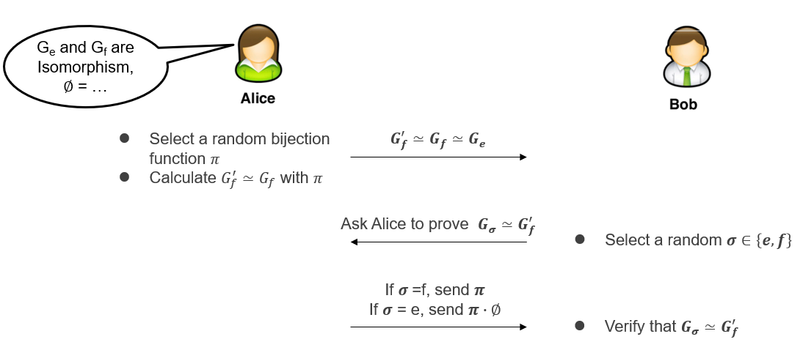
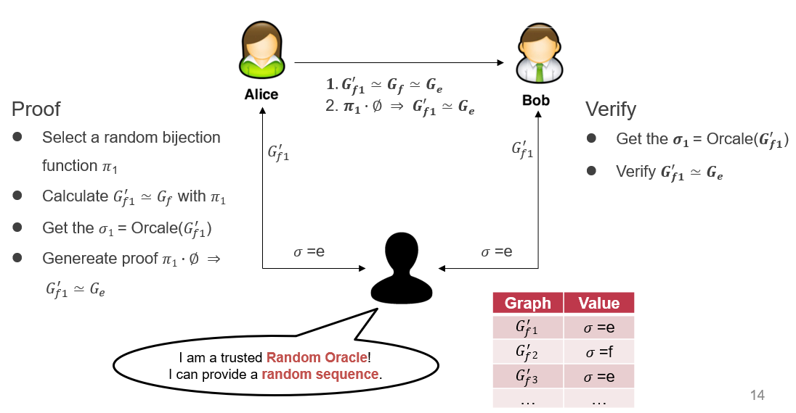
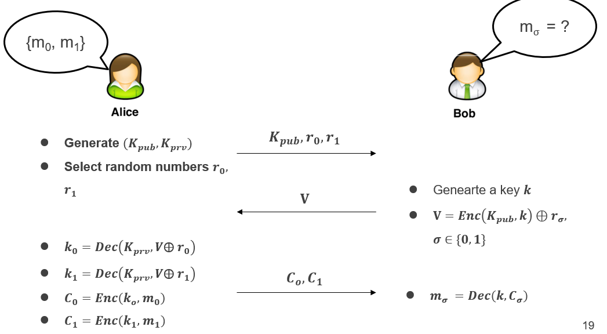

# 16. Data Privacy
## ZKP: Zero-Knowledge Proof
Problem: Alice想向Bob证明她has the answer A of the problem P，如果直接发送A，则Bob也知道了A

Zero-Knowledge Proof: 
- Completeness: Alice can construct the proof if she has A
- Soundness: Alice cannot construct the proof if she doesn’t have A
- Zeroknowledge: Bob knows nothing about A

Interactive Zero-Knowledge Proof: P has answer 𝒙 of a problem 𝑳, and tries to prove it with > 1 iterations:
- Step-1: P transfers 𝑳 to 𝑳′, and promises that 𝑳′ is transferred from 𝑳 and she has the answer 𝒙′  
- Step-2: V challenges P
- Step-3: P shows the proof of the answer 𝒙′, which will not leak 𝒙
- V trusts that P has 𝒙 when P always meets the challenge

图的同构：If G1 = (V1, E1) and G2 = (V2, E2) are isomorphic, there exist a bijection function（双射，即一一对应函数） 𝝓, that for any (𝒖, 𝒗)∈𝑬_𝟏, exist 𝝓(𝒖, 𝒗)  ∈𝑬_𝟐，即两张图的每条边都一一对应
- 基于图同构的Interactive ZKP
    - Alice生成一个与两张图都同构的新图，反复询问迭代
    - 
  

- Non-Interactive ZKP
    - 有一个可信的第三方生成随机序列，让Alice一次性证明
    - 
  

## OP: Oblivious Transfer 不经意传输
Problem: sender不想让receiver拿到所有数据，receiver不想让sender知道自己想要哪个数据

1-out-of-2 OT: 
- 
  

- Bob把自己的key用Alice的公钥加密，并与$r_i$作异或
- Alice分别用两个解密结果加密她的两份消息，将加密结果送给Bob（只有Bob选择的i才能解密出Bob的key，且Alice不知道Bob选择了哪个） 
- Bob用k解密两份密文，得到需要的消息，而另一份无法解密

## HE: Homomorphic Encryption 同态加密
Problem: 想把数据放在云端计算，但想加密

Solution: 密文可以直接运算，返回结果后用户解密即可。但目前算法难以支持所有密文运算，例如RSA只支持乘法

## SMPC: Secure Multi-Party Computing
Problem: 多方拥有不同数据，想用这些数据共同计算而又不将数据泄露给其他方

Yao's Protocol: GC(Garbled Circuits)+OT(Oblivious Transfer), 姚期智的混淆电路+不经意传输算法

## TEE: Trusted Execution Environmnet
- Software TEE
    - VM-based TEE
    - Same privilege protection
- ARM TrustZone
- Intel SGX
- AMD SME/SEV
- Penglai, SANCTUM

## DP: Differential privacy 差分隐私
Problem: 想要拒绝用户访问数据库单个条目，但不能简单限制，否则可以通过sum(*) - sum(where != xx)反推出

Solution: （若两个数据集有且仅有一条数据不一样，则称此二者为相邻数据集）如果某算法作用于任何相邻数据集，得到一个特定输出的概率应差不多，那么我们就说这个算法能达到差分隐私的效果。也就是说，观察者通过观察输出结果很难察觉出数据集一点微小的变化，从而达到保护隐私的目的。差分度越低，安全性越高。
- 实现方式：向计算函数中加噪声

## FL: Federated Learning 联邦学习
Problem: 多方训练同一个模型，需要保证各方数据隐私

- 横向：一方拥有一个样本的全部数据
    - 服务器分发子模型给每个用户，用户提交update，会泄露个人隐私
    - 用户向update中添加噪声，并保证总体对称，相互抵消，不影响总模型更新
    - 如果有用户掉线，服务器必须向其他用户询问该用户的噪声偏移量；则服务器可以伪造用户掉线，通过询问计算出该用户原本的update
    - Secret Sharing & Double Masking算法
        - Share a secret S among N nodes, T nodes can reconstruct the secret，基于k次函数方程求解需要k以上个点的原理
        - Each user u generates $a_u$ and $S_{u,v}$ (for each user pair (u,v))
        - Each user u updates $y_u$，是关于a和S的函数
        - Server计算$\sum y_i$
            - For online node u, server asks other nodes to get the secret share of the $a_u$
            - For offline node u, server asks other nodes to get the secret share of the $S_{u,i}$
            - 所有节点防止server同时得到$a_u$ and $S_{u,i}$

- 纵向：每一方拥有同一个样本的部分数据
    - 每方分别单独训练，在全连接层汇总，由有label的一方算出最终模型

后面介绍了3篇论文，是对以上技术的具体应用
- Oblivious Multi-Party Machine Learning on Trusted Processors (Security’2016)
- BatchCrypt: Efficient Homomorphic Encryption for Cross-Silo Federated Learning (ATC’20)
- Privacy Accounting and Quality Control in the Sage Differentially Private ML Platform (SOSP’19)
